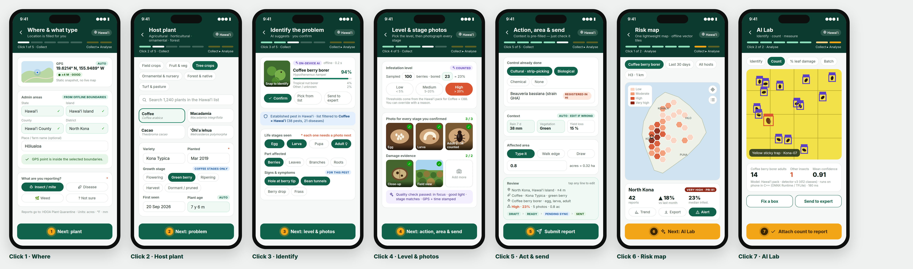

# PestLand

Plant-health surveillance app for **any plant** (agricultural, horticultural, ornamental, forest and native) in **any region**. It is built on the CropProtect backbone, with features taken from ODK Collect, Plantix and FAO FAMEWS.

- **5 clicks to collect** a report: Where · Host plant · Identify · Level & stage photos · Action, area & send
- **2 clicks to analyse**: Risk map (H3 hexagon risk index) · AI Lab (on-device identification and counting)
- **Region packs**: choose Hawaiʻi and every list, rule, map, language and AI model stays inside Hawaiʻi. Guam, the US states, Australia, PNG and Kenya work the same way.
- **Light**: one offline MapLibre map, opened only for drawing an area and for the risk map

## Contents

| Path | What |
|---|---|
| [`docs/PestLand_User_Manual.docx`](docs/PestLand_User_Manual.docx) | **User manual (Word)** in the CropProtect manual style: brief description + how to fill it + screenshot for every field |
| [`docs/PestLand_User_Manual.md`](docs/PestLand_User_Manual.md) / [`.pdf`](docs/PestLand_User_Manual.pdf) | Same manual as Markdown and PDF |
| [`docs/TECHNICAL_SPEC.md`](docs/TECHNICAL_SPEC.md) | PERN + C++ architecture, region packs, AI pipeline, sync, CropProtect field mapping |
| `docs/images/` | Screen mockups, diagrams and analysis charts (PNG) |
| `design/` | HTML/CSS sources of the mockups and diagrams, plus `render.py` |
| `config/regions/` | Sample region-pack manifests: `us-hi`, `gu`, `us`, `au`, `pg`, `ke` |
| `db/schema.sql` | PostgreSQL + PostGIS + h3-pg schema |
| `data/incident_reports_anonymized.csv` | 38,762 CropProtect reports with collector names pseudonymized and GPS rounded to about 110 m |
| `scripts/` | Anonymizer, analysis figures, PDF and Word builders |

Stack: React Native + Expo + NativeWind (Tailwind) · Node 22 + Express 5 · PostgreSQL 17 + PostGIS + h3-pg · React 19 + Vite + Tailwind v4 web console · C++ JSI modules (ONNX Runtime / LiteRT, H3, geometry).

Status: design and specification stage. App source code has not been written yet.
