# PestLand — User Manual

**Plant health surveillance for any plant, any region**
Version 1.0 · September 2026

---

## Contents

1. [What PestLand is](#1-what-pestland-is)
2. [Getting started](#2-getting-started)
3. [Home screen](#3-home-screen)
4. [The 5 + 2 clicks at a glance](#4-the-5--2-clicks-at-a-glance)
5. [Click 1 — Where & what type](#5-click-1--where--what-type)
6. [Click 2 — Host plant](#6-click-2--host-plant)
7. [Click 3 — Identify the problem](#7-click-3--identify-the-problem)
8. [Click 4 — Level & stage photos](#8-click-4--level--stage-photos)
9. [Click 5 — Action, area & send](#9-click-5--action-area--send)
10. [Working offline & sync](#10-working-offline--sync)
11. [Click 6 — Risk map (results)](#11-click-6--risk-map-results)
12. [Click 7 — AI Lab (identify & count)](#12-click-7--ai-lab-identify--count)
13. [Taking PestLand to another region](#13-taking-pestland-to-another-region)
14. [CropProtect → PestLand field map](#14-cropprotect--pestland-field-map)
15. [Data, privacy & support](#15-data-privacy--support)

---

## 1. What PestLand is

PestLand is a mobile app for reporting and mapping insect pests, plant diseases and weeds on **any plant**: field crops, fruit and vegetables, tree crops, ornamentals and nursery stock, forest and native plants, turf and pasture.

It keeps the backbone of **CropProtect** (where → plant → problem → evidence → context → area → submit) and adds what CropProtect was missing:

| Borrowed from | What PestLand adds |
|---|---|
| **ODK Collect / Central** | Draft › Ready › Pending › Sent states, validation rules, GPS accuracy check, form versioning, safe re-sync, web review queue |
| **Plantix** | Photo-first AI identification, picture cards for plants and pests, photo coaching, many languages |
| **FAO FAMEWS** | Standard sampling (count → % → level), trap counts, risk/hotspot maps, early-warning alerts |
| **New in PestLand** | Region packs, one photo for every life stage, on-device AI counting, hexagon risk index, only one lightweight map |

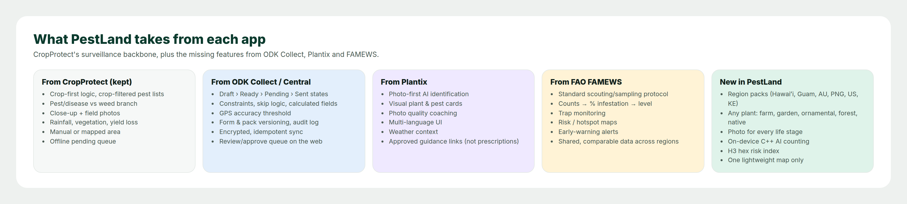

**Two design rules**

- **Simple:** 5 screens to collect a report, 2 screens to see results. Anything the phone can work out (location names, plant age, weather, level from a count) is filled in for you.
- **Light:** CropProtect loaded a Google/Leaflet map on several pages. PestLand opens a map **only** when you draw an area or look at the risk map, and that map uses small offline vector tiles. Click 1 shows a static snapshot, not a live map.

---

## 2. Getting started

### 2.1 Install and allow permissions

Install PestLand and tap **Allow while using the app** for:

| Permission | Why |
|---|---|
| Location | Fills in GPS and all admin areas in Click 1 |
| Camera | Stage photos, damage photos, AI identification |
| Storage / photos | Keeps reports and photos offline until they are sent |
| Notifications (optional) | Regional alerts and "needs your attention" messages |

### 2.2 Sign in

Sign in with your email (or the phone number your region uses). Your role (collector, expert, reviewer or region admin) decides what you see. Collectors see the 5 + 2 clicks; experts also see the ID queue; admins can edit region packs.

### 2.3 Choose your region pack

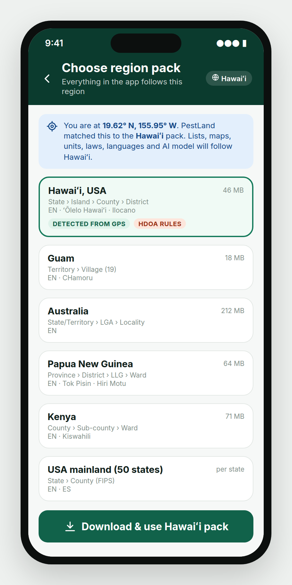

On first launch PestLand reads your GPS and suggests a **region pack**, for example *Hawaiʻi*. Tap **Download & use**.

A region pack decides **everything** that follows: admin areas, plant list, pest list, legal status of each pest, severity rules, control products, AI model, offline map, language and units. When you pick Hawaiʻi, every list and map stays inside Hawaiʻi. See [Section 13](#13-taking-pestland-to-another-region).

You can hold several packs and switch any time from **Profile › Region**. If you travel to a place your pack doesn't cover, PestLand warns you and offers the matching pack.

---

## 3. Home screen

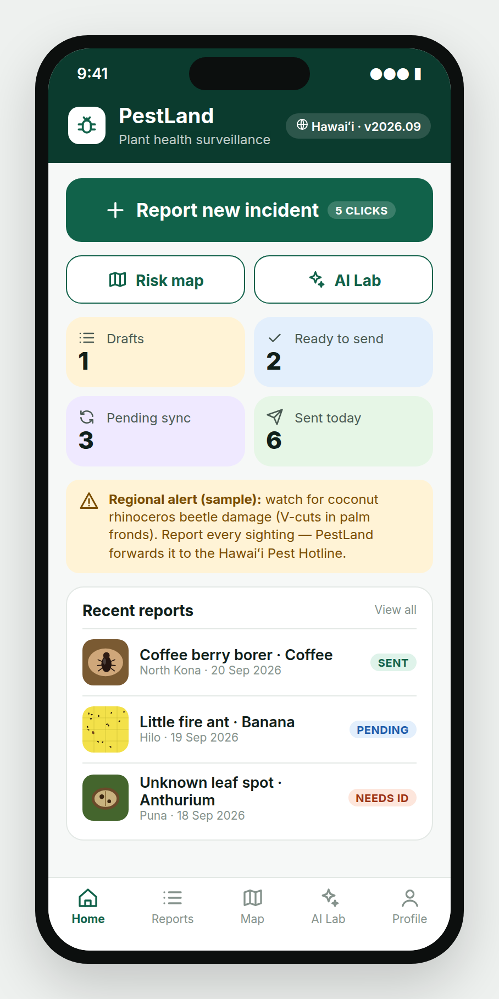

| Element | What it does |
|---|---|
| **Report new incident** | Starts the 5-click report |
| **Risk map** / **AI Lab** | Jump straight to Click 6 or Click 7 |
| **Drafts** | Reports you started but have not finished |
| **Ready to send** | Finished reports waiting for you to tap Submit |
| **Pending sync** | Submitted with no signal. They go automatically when you are back online |
| **Sent today** | Reports the server has received |
| **Regional alert** | Messages from the region's plant-protection agency |
| **Recent reports** | Status tags: *Sent*, *Pending*, *Needs ID* (an expert still has to name the problem) |

---

## 4. The 5 + 2 clicks at a glance

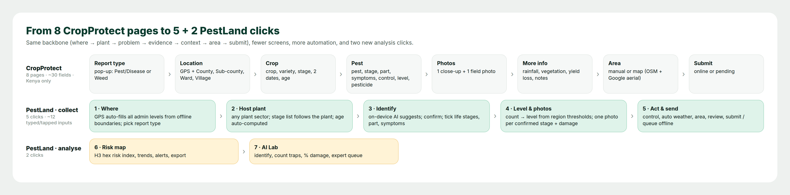

A **click** here means one screen, finished with one **Next** tap. The yellow numbered dot on each Next button shows which click you are on, and the bar at the top shows your progress: 5 green segments for collecting, then 2 amber ones for analysing.

| Click | Screen | You do | PestLand does for you |
|---|---|---|---|
| 1 | Where & what type | Check location, pick Insect / Disease / Weed / Not sure | GPS, accuracy, every admin level, boundary check |
| 2 | Host plant | Pick sector and plant, stage, planting date | Stage list for that plant, plant age |
| 3 | Identify | Snap a photo, confirm the AI suggestion, tick stages, parts and symptoms | AI suggestion, lists filtered to *this plant in this region*, legal status |
| 4 | Level & stage photos | Enter your sample count or pick a level, then take one photo per stage | % infestation → level from the region's rule, photo quality check, AI count |
| 5 | Action, area & send | Control used, yield loss, area, Submit | Weather, vegetation, unit conversion, review summary, offline queue |
| 6 | Risk map | Filter and read | Hexagon risk index, trend, alerts, export |
| 7 | AI Lab | Photograph a trap or leaf | Identification, counting, % damage, expert queue |

CropProtect needed 8 pages and about 30 fields. PestLand collects the same information in 5 screens with about 12 typed or tapped inputs.

---

## 5. Click 1 — Where & what type

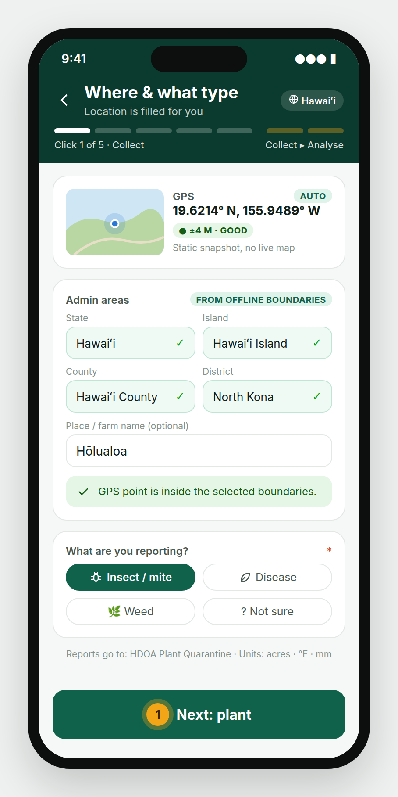

**GPS (automatic).** Latitude and longitude are filled in with an accuracy badge:

| Badge | Accuracy | What to do |
|---|---|---|
| ● Good | ≤ 10 m | Continue |
| ● Fair | 10–30 m | Continue, or step into the open and wait a few seconds |
| ● Poor | > 30 m | PestLand asks you to wait or confirm the areas by hand |

**Admin areas (automatic).** PestLand looks up your GPS point in the offline boundaries of your region pack and fills in **every level**. In Hawaiʻi that is State › Island › County › District. In Kenya it is County › Sub-county › Ward, the same as CropProtect. Tap any level to change it.

**Boundary check.** If the areas you pick don't contain your GPS point, a yellow warning appears. In the CropProtect data about 1 in 100 reports from the three main counties sat more than 80 km from their county's centre. The check stops that kind of error at the source.

**Place / farm name** is optional, for example *Hōlualoa* or a farm name.

**What are you reporting?** Pick one:

- **Insect / mite**: any animal pest (includes nematodes, snails and slugs in the pack lists)
- **Disease**: fungi, bacteria, viruses, phytoplasma, abiotic look-alikes
- **Weed**: weeds and invasive plants
- **Not sure**: PestLand continues, makes photos compulsory and sends the report to an expert (*Needs ID*)

Tap **Next: plant** (click 1).

---

## 6. Click 2 — Host plant

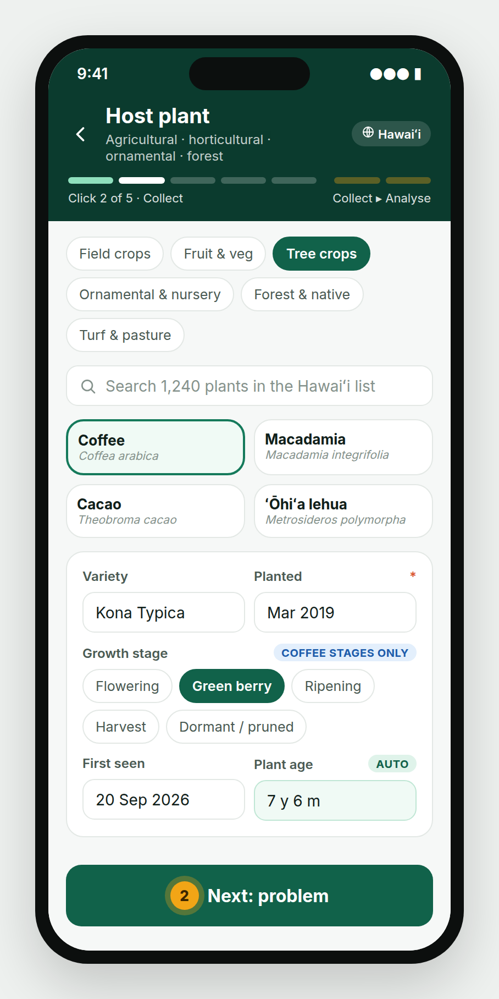

1. **Sector:** Field crops · Fruit & veg · Tree crops · Ornamental & nursery · Forest & native · Turf & pasture.
2. **Plant:** tap a card, or search the region's list (for example 1,240 plants in Hawaiʻi). If a plant is missing, type it under **Other**. The report is kept and the region admin is told.
3. **Variety** (optional), e.g. *Kona Typica*.
4. **Growth stage:** only the stages of the plant you picked are shown (coffee: flowering, green berry, ripening, harvest, dormant/pruned).
5. **Planted** and **First seen** dates. PestLand works out the **plant age** and blocks impossible dates, such as planting after the problem was first seen. Choose *Unknown* if the grower doesn't know.

Tap **Next: problem** (click 2).

---

## 7. Click 3 — Identify the problem

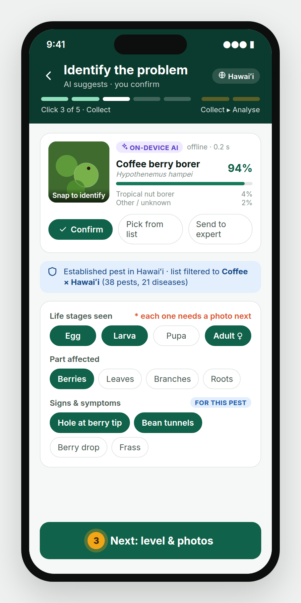

1. **Snap to identify.** Take one clear photo. The on-device AI (it works offline in about 0.2 s) shows its top three answers with confidence, e.g. *Coffee berry borer 94 %*.
2. Choose one:
   - **Confirm**: accept the top answer
   - **Pick from list**: the list shows only problems recorded on **this plant in this region**
   - **Send to expert**: the report is saved as *Needs ID*
3. **Status badge.** PestLand shows the problem's status in your region: *Established*, *Regulated*, *Quarantine*, *Exotic* or *New to region*. Regulated, quarantine and exotic reports are forwarded to the agency named in the region pack (in Hawaiʻi, HDOA through the 643-PEST hotline; in Australia, the Exotic Plant Pest Hotline).
4. **Life stages seen:** tick every stage you actually saw (Egg · Larva/Nymph · Pupa · Adult). For diseases the stages are *Early · Advancing · Late*. **Each ticked stage needs its own photo in Click 4.**
5. **Part affected** and **Signs & symptoms:** multi-select. These lists are filtered to the chosen problem.

> The AI is an assistant, not the final word. Your confirmed choice is what is recorded, and the AI's answer is stored alongside it so experts can check both.

Tap **Next: level & photos** (click 3).

---

## 8. Click 4 — Level & stage photos

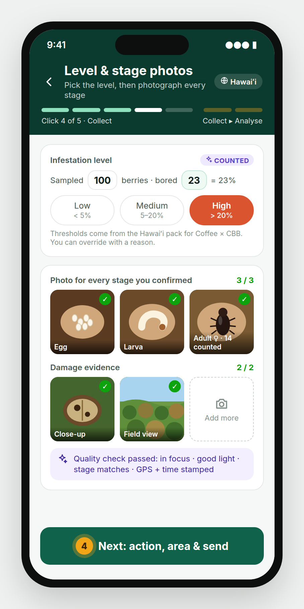

### 8.1 Select the level first

PestLand replaces CropProtect's bare "Low / Medium / High" with a **count-based level** (the FAMEWS approach):

1. Enter the **sample size** and the number **affected**, e.g. 100 berries sampled, 23 bored.
2. PestLand works out the **%** (23 %) and picks the level using the region pack's rule for this plant and pest:

| Coffee × coffee berry borer, Hawaiʻi pack (example) | Low | Medium | High |
|---|---|---|---|
| Bored berries per 100 | < 5 % | 5–20 % | > 20 % |

3. If you disagree, tap another level and give a reason. Both values are kept.

If a pest has no counting rule, PestLand uses the pack's default (% plants affected), and you can always pick a level by eye.

### 8.2 Then photograph every confirmed stage

As soon as the level is set, PestLand opens **one camera slot for every stage you ticked in Click 3**, plus two damage slots:

- **Stage photos:** Egg, Larva, Pupa, Adult (or Early / Advancing / Late for diseases)
- **Damage close-up:** the affected organ
- **Field view:** the wider patch, to show how far the damage has spread
- **Add more:** optional extra photos

The **Next** button stays locked until every ticked stage has a photo that passes the automatic quality check (focus, light, stage visible). Every photo is stamped with GPS and time. When the AI can count (adults on a berry, insects on a trap), the count appears on the photo, e.g. *Adult ♀ · 14 counted*.

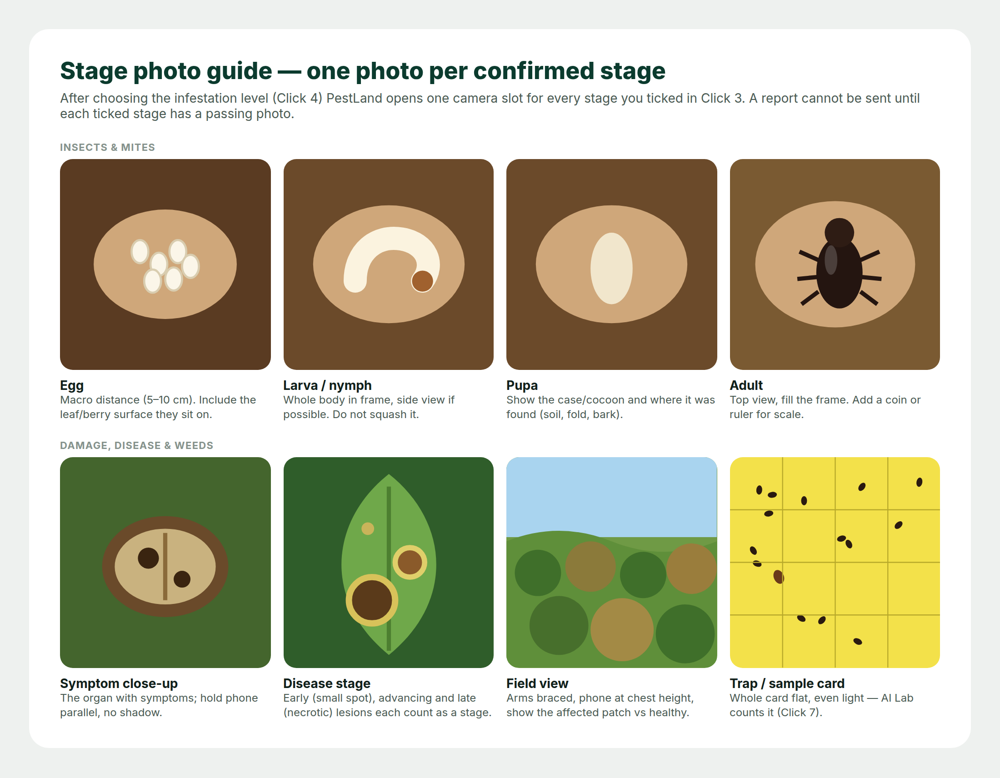

**Photo tips (from the CropProtect manual, still valid)**

- Hold the phone **parallel** to the pest or leaf and don't cast a shadow.
- Get close enough that the pest **fills the frame**. Don't disturb it.
- For the field view, lift the phone to chest height with both hands and brace your elbows against your body.
- Use **Retry** freely. Only accepted photos are kept.
- Photos are compressed for sending (about 350 KB in low-bandwidth packs such as PNG). The original stays on the phone until it has synced.

Tap **Next: action, area & send** (click 4).

---

## 9. Click 5 — Action, area & send

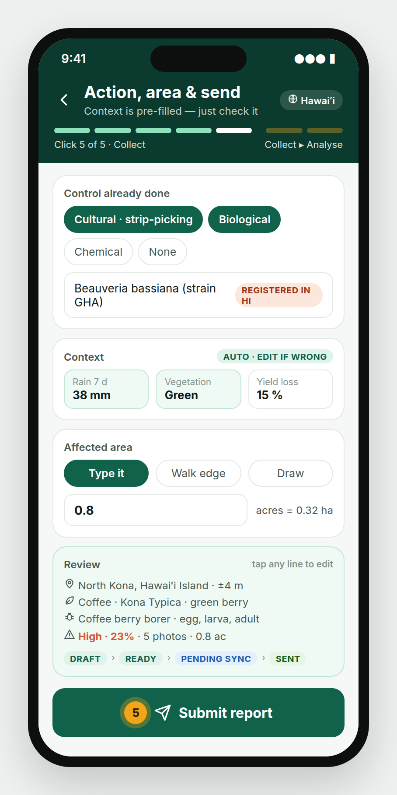

**Control already done** (multi-select): Cultural · Physical/mechanical · Biological · Chemical · None. If you pick Chemical or Biological, choose the **product** from the region's registered list, or type it under *Other*. PestLand records what was done. It does not prescribe treatments.

**Context (pre-filled, edit if wrong).**

| Field | Source | Note |
|---|---|---|
| Rain, last 7 days | Weather service (when online) or grower's answer | The source is stored, so observed and reported values stay separate |
| Vegetation around the field | Suggested from the field-view photo | Green · Greening · Drying · Dry |
| Estimated yield loss | Grower / you | Limited to 0–100 % |

In the CropProtect export, rainfall was blank in 88 % of reports. Filling it automatically fixes that.

**Affected area.** Choose one:

- **Type it:** acres or hectares, following the region pack. Both are shown.
- **Walk edge:** walk around the patch and PestLand records the GPS track.
- **Draw:** this is the only place in data collection that opens a map (offline vector tiles). Tap corners, then tap the first corner again to close the shape.

**Review.** A one-card summary. Tap any line to go back and edit.

**Submit** (click 5). With a signal the report is sent. Without one it moves to *Pending sync* and goes automatically later.

---

## 10. Working offline & sync

Every report moves through clear states, as in ODK:

**Draft → Ready → Pending sync → Sent → Approved / Rejected / Needs ID**

- Everything works offline: lists, boundaries, AI, map tiles and the photo checks all live in the region pack on your phone.
- Each report gets a unique ID on the phone, so a retry never creates a duplicate.
- Photos upload in pieces and resume after a dropped connection.
- In packs marked *low connectivity* (e.g. PNG), a short text summary can be sent by SMS and the photos follow later.
- Send the day's reports after fieldwork, as the CropProtect manual advised. PestLand reminds you if anything is still *Pending* at the end of the day.

---

## 11. Click 6 — Risk map (results)

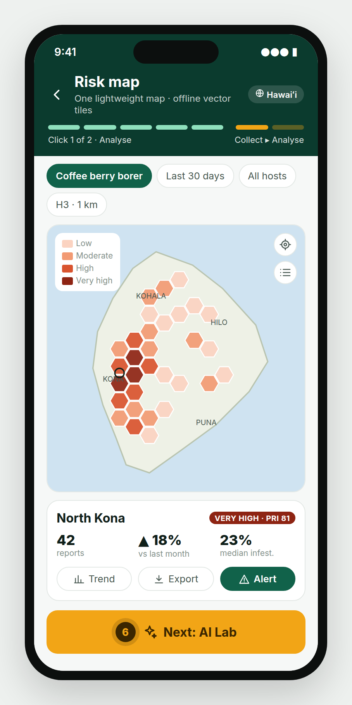

The risk map is the **one** analysis map in PestLand. It shows **hexagon cells** (H3, about 1 km across) coloured by the **PestLand Risk Index (PRI)**:

> **PRI = 100 × (average severity − 1) / 2 × confidence**
> where severity is Low = 1, Medium = 2, High = 3, and confidence = min(1, reports in cell ÷ 5)

| PRI | Class |
|---|---|
| < 25 | Low |
| 25–50 | Moderate |
| 50–75 | High |
| ≥ 75 | Very high |

**Filters** (one row at the top): problem · period · host · cell size.
**Tap a cell or area** to see the number of reports, the trend against last month and the median infestation, then use:

- **Trend:** weekly chart
- **Export:** CSV, GeoJSON, Shapefile
- **Alert:** notify the agency or extension officers for that area

### 11.1 Example from real data (CropProtect export, anonymized)

The figures below come from the 38,762 CropProtect records collected between March 2024 and February 2026: 34,187 pest/disease and 4,547 weed reports. PestLand produces the same views automatically.

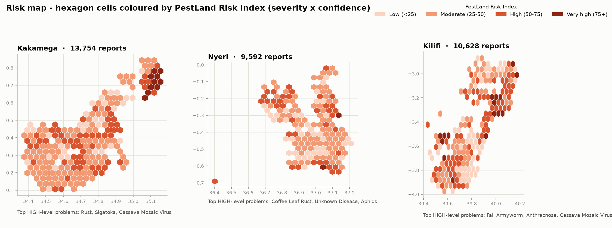

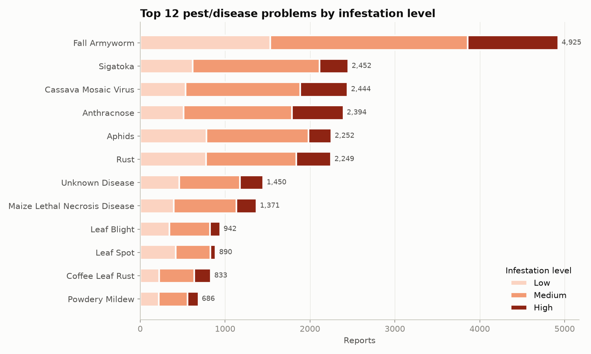

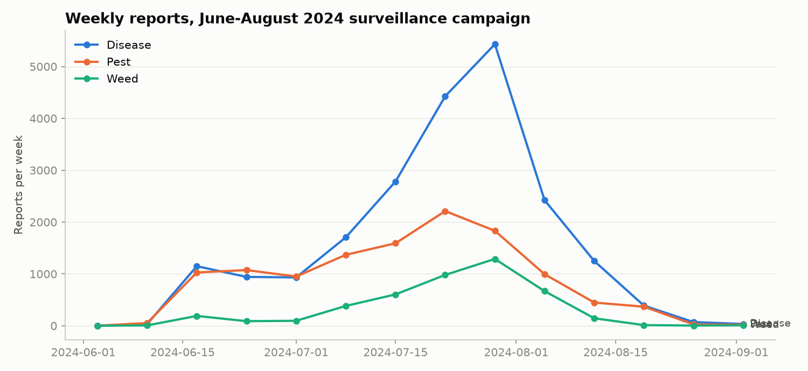

What the data shows, and what PestLand changes because of it:

- **Fall armyworm** was the most reported problem (4,925 pest/disease reports, over 1,000 of them *High*). PestLand's count-based level makes these severities comparable across collectors.
- **1,458 "Unknown disease"** reports had no route to an expert. In PestLand they become *Needs ID* and go into the expert queue with photos of every stage.
- Most reports were collected in a **June–August 2024 campaign**. The weekly trend view makes gaps in surveillance visible.

---

## 12. Click 7 — AI Lab (identify & count)

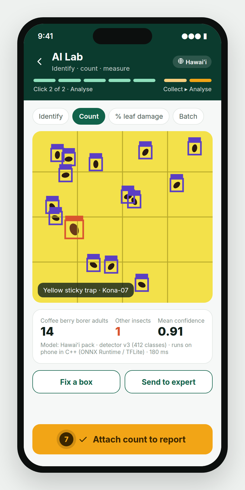

| Mode | Use it for | Output |
|---|---|---|
| **Identify** | Any photo of a pest, symptom or weed | Top-3 names with confidence |
| **Count** | Sticky traps, pheromone traps, berries, leaves with insects | Boxes around each object + totals per species |
| **% leaf damage** | Leaf or canopy photos | % area damaged → suggested level |
| **Batch** | A set of trap photos from a route | Counts per trap, sent as trap readings |

- The AI runs **on the phone** (native C++ engine) so it works offline. The model comes with the region pack, e.g. *Hawaiʻi detector v3, 412 classes*.
- **Fix a box:** drag, delete or relabel a box. Your correction is saved and used to improve the next model.
- **Send to expert:** puts the photo in the expert queue.
- **Attach count to report** (click 7) adds the count to the current or a new report.

---

## 13. Taking PestLand to another region

**"What if I take it to Australia, Guam or PNG?"** Nothing in the app changes except the **region pack**. Pick the new region, or let GPS pick it, and every list, rule, map and language switches with it.

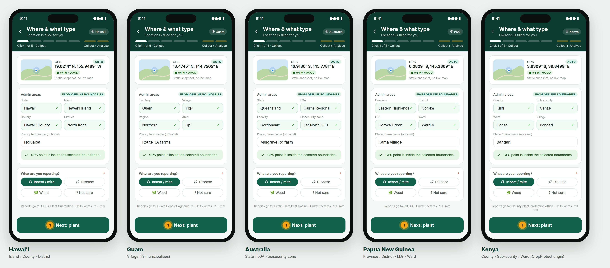

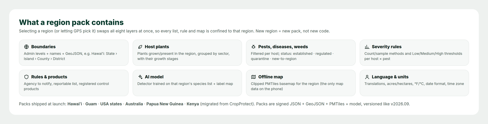

| Region pack | Admin levels (Click 1) | Units | Languages | Example problems | Report channel |
|---|---|---|---|---|---|
| **Hawaiʻi** | State › Island › County › District | acre, °F | English, ʻŌlelo Hawaiʻi, Ilocano | Coffee berry borer, coffee leaf rust, coconut rhinoceros beetle, little fire ant, Rapid ʻŌhiʻa Death | HDOA Plant Quarantine · 643-PEST |
| **Guam** | Territory › Village (19) | acre, °F | English, CHamoru | Coconut rhinoceros beetle, cycad aulacaspis scale, little fire ant | Guam Dept. of Agriculture (set by admin) |
| **USA mainland** | State › County (FIPS) | acre, °F | English, Spanish | Spotted lanternfly, emerald ash borer | State Dept. of Agriculture + USDA APHIS |
| **Australia** | State/Territory › LGA › Locality (+ biosecurity zone) | hectare, °C | English | Fall armyworm, Queensland fruit fly, Panama TR4; Xylella (exotic watch) | Exotic Plant Pest Hotline 1800 084 881 |
| **Papua New Guinea** | Province › District › LLG › Ward | hectare, °C | English, Tok Pisin, Hiri Motu | Cocoa pod borer, coffee berry borer, coconut rhinoceros beetle, fall armyworm | NAQIA (set by admin) |
| **Kenya** (from CropProtect) | County › Sub-county › Ward (+ Village) | acre, °C | English, Kiswahili | Fall armyworm, Sigatoka, cassava mosaic, MLN | County plant-protection office |

**The same pest can have a different status in different regions.** Coffee berry borer is *established* in Hawaiʻi but listed as *regulated* in the PNG example pack, so a PNG report triggers an agency notification and a Hawaiʻi report does not.

**A region that doesn't have a pack yet:** a region admin builds one in the web console from boundaries (GeoJSON), plant and pest lists (CSV), severity rules, contacts and translations. PestLand's shared global model is used until a regional AI model has been trained. See `docs/TECHNICAL_SPEC.md` §4.

**Moving between islands or states:** packs can nest (USA › Hawaiʻi; Australia › Queensland). The app uses the most specific pack that contains your GPS point.

---

## 14. CropProtect → PestLand field map

For teams moving from CropProtect. Every CropProtect field is kept or improved.

| CropProtect page · field | PestLand click · field | Change |
|---|---|---|
| Report type pop-up (Pest/Disease, Weed) | 1 · What are you reporting? | Adds *Not sure* and splits Insect from Disease |
| Location · Lat/Long | 1 · GPS | Adds accuracy badge |
| Location · County, Sub-county, Ward | 1 · Admin areas | Filled automatically. Levels follow the region |
| Location · Village | 1 · Place / farm name | Same, optional |
| Crop · Crop affected | 2 · Sector + Plant | Any plant type, picture cards |
| Crop · Variety | 2 · Variety | Same |
| Crop · Crop stage | 2 · Growth stage | Filtered per plant |
| Crop · Planting date, Initial detection date | 2 · Planted, First seen | Date logic enforced |
| Crop · Crop age | 2 · Plant age | Calculated automatically |
| Pest · Pest/Disease | 3 · AI suggestion + confirm | Adds AI, *Needs ID* and legal status |
| Pest · Pest stage | 3 · Life stages seen | Multi-select. Each stage needs a photo |
| Pest · Part affected, Signs/Symptoms | 3 · Part affected, Signs & symptoms | Same, filtered |
| Pest · Level of infestation | 4 · Count → level | Count-based, per region rule |
| Photos · Pest/Disease photo | 4 · One photo per stage | 1 photo → one per stage |
| Photos · Damage severity photo | 4 · Close-up + Field view | Split in two |
| Pest · Control measures, Pesticide used | 5 · Control done + product | Controlled product list |
| Weed · Weed, Control, Chemical | 3 + 5 (same screens, weed lists) | One flow instead of two |
| More info · Rainfall, Vegetation | 5 · Context | Pre-filled with the source recorded |
| More info · Yield loss, Additional info | 5 · Yield loss, Notes | Limited to 0–100 % |
| Area · Manual / Mapping / Aerial imagery | 5 · Type it / Walk edge / Draw | One offline map, no Google overlay |
| Submit / Pending submissions | 5 · Submit + sync states | Draft › Ready › Pending › Sent |
| — | 6 · Risk map | **New** |
| — | 7 · AI Lab | **New** |

---

## 15. Data, privacy & support

- **Your reports** belong to the programme that runs your region pack. Reviewers in your region see them. The public risk map shows only hexagon summaries, never individual farms.
- **Personal details:** collector names are never published. Exports use pseudonymous collector IDs (e.g. `COL-042`). The CropProtect sample data in this repository has had collector names replaced this way and GPS rounded to about 100 m. It contained no email or phone columns.
- **Photos** keep their GPS and time for audit and are shared only through signed links.
- **Support:** use **Profile › Help** in the app. It shows the support email and phone number that your region admin has set for your region pack.

*Well done. Every report you send makes the risk map sharper for everyone in your region.*
