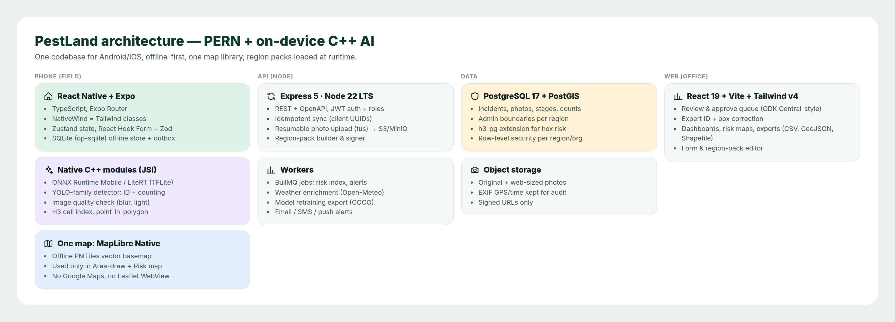

# PestLand — Technical Specification

Companion to the [User Manual](PestLand_User_Manual.md). Audience: developers, data managers and region admins.



## 1. Stack (PERN + native C++)

| Layer | Choice | Why |
|---|---|---|
| Mobile | **React Native 0.8x (New Architecture) + Expo SDK**, TypeScript, Expo Router | One codebase for Android and iOS; the "R" in PERN on the phone |
| Styling | **NativeWind v4** (Tailwind classes in RN) · **Tailwind CSS v4** on web | Same design tokens on phone and web (`design/base.css` mirrors them) |
| Forms | React Hook Form + **Zod** schemas generated from the region pack | ODK-style constraints and skip logic without XLSForm |
| Local store | SQLite (op-sqlite) + outbox table | Offline-first; Draft › Ready › Pending › Sent |
| Native / C++ | JSI TurboModules in **C++**: ONNX Runtime Mobile (or LiteRT/TFLite), image quality (blur/exposure), **H3** indexing, point-in-polygon (boundaries) | Speed and offline operation; one C++ core shared by Android and iOS |
| Map | **MapLibre Native** + **PMTiles** vector basemap, clipped per region | Replaces Google Maps + Leaflet. Opened only in *Area › Draw* and *Risk map* |
| API | **Node.js 22 LTS + Express 5**, OpenAPI 3.1, JWT (access/refresh), role-based access | The "E" and "N" |
| Jobs | BullMQ (Redis): risk-index refresh, weather enrichment, alerts, model-training export | Keeps the API fast |
| Database | **PostgreSQL 17 + PostGIS 3.5 + h3-pg** | The "P"; spatial queries, hex aggregation, row-level security per region |
| Files | S3-compatible (AWS S3 / MinIO); tus resumable uploads; signed URLs | Photos survive bad networks |
| Web console | **React 19 + Vite + Tailwind v4**, MapLibre GL JS | Review queue, expert ID, dashboards, pack editor |
| AI training | Python (Ultralytics YOLO-family detector) → export ONNX / TFLite, int8 quantized, about 6–12 MB per region model | Runs on mid-range Android phones in about 150–250 ms |

### Why only one map

CropProtect loaded a map widget (OSM base + Google aerial) inside the form. That adds weight, needs a network connection and slows low-end phones. PestLand:

1. **Click 1** shows a **static snapshot** image rendered from the offline tiles, with no interactive map.
2. **Click 5 › Draw** and **Click 6 › Risk map** open the same MapLibre view. It is loaded lazily and uses the region's PMTiles file (Hawaiʻi is about 30 MB).
3. There is no Google Maps SDK and no Leaflet WebView. Satellite imagery is an optional online raster layer that the region admin can switch on.

## 2. The 5 + 2 clicks as screens

| Click | Route | Required inputs | Automated |
|---|---|---|---|
| 1 | `/report/where` | report_type | geom, gps_accuracy_m, admin_path (C++ point-in-polygon), boundary_ok |
| 2 | `/report/host` | host_id, host_stage | host_age, date constraints |
| 3 | `/report/problem` | problem_id **or** needs_id, stages_seen ≥ 1 | ai_suggestion (C++ ONNX), region status lookup, filtered lists |
| 4 | `/report/evidence` | level (or sample counts), one `stage` photo per stages_seen, damage_closeup, field_view | infestation_pct → level (pack rule), photo quality, AI count |
| 5 | `/report/finish` | area (any method) | rain_7d_mm (Open-Meteo when online), vegetation hint, unit conversion, review |
| 6 | `/results/risk` | — | `risk_cell_30d` view, trend, alerts |
| 7 | `/ai-lab` | photo | detection boxes, counts, % damage |

**Hard rule (Click 4):** `Next` is disabled while `incident_missing_stage_photos` would return rows for the draft. The same check runs on the server as a view (`db/schema.sql`).

## 3. AI pipeline

1. **Data:** stage photos with confirmed labels plus expert box corrections (`detection` rows where `model = 'expert:*'`) are exported nightly in COCO format.
2. **Train** per region, starting from the global model's weights. Classes are `species × stage`, e.g. `hypothenemus_hampei:adult`.
3. **Evaluate** on a held-out set per region. A model ships only if mAP50 does not regress and the top-3 ID accuracy is ≥ 90 % on the region's regulated species.
4. **Package** into the region pack (`ai_model` in the manifest) together with the label map. The phone downloads it with the pack.
5. **On device:** the C++ module runs pre-processing, inference, NMS and counting and returns `{boxes, counts, top3}` to JS through JSI.
6. **Human in the loop:** the AI only suggests. The confirmed `problem_id` and `id_method` are always stored separately from `ai_suggestion`.

## 4. Region packs

Sample manifests: [`config/regions/`](../config/regions) — `us-hi`, `gu`, `au`, `pg`, `ke`, `us`.

```
<id>.plpack  (signed zip)
├── manifest.json          # config/regions/<id>.json
├── boundaries/<id>.geojson
├── lists/hosts.csv  lists/problems.csv  lists/region_problem.csv
├── products/<id>.json     # registered control products
├── i18n/<lang>.json
├── models/<id>-det-vN.onnx + labels.json
└── tiles/<id>.pmtiles
```

- **Confinement:** every list query is `WHERE region_id = :pack`. Boundaries, hosts, problems, severity rules, products, model and tiles all come from the pack, so choosing Hawaiʻi keeps everything inside Hawaiʻi.
- **Nesting:** `us` › `us-hi`; `au` › `au-qld`. The most specific pack whose footprint contains the GPS point wins.
- **Versioning:** `pack_version` is stored on every incident, like ODK form versions, so old reports stay interpretable after lists change.
- **New region checklist:** boundaries GeoJSON · host list · problem list with status per host · severity rules · products · contacts · translations · tiles · model (or the global fallback).

## 5. Data model and CropProtect mapping

Full DDL: [`db/schema.sql`](../db/schema.sql). It has been syntax-checked on PostgreSQL 16 with the PostGIS/H3 types stubbed out, so it still needs a run on a PostGIS 3.5 + h3-pg database.

| CropProtect CSV column | PestLand column |
|---|---|
| `name` | `collector_id` (FK to `app_user`; pseudonymous in exports) |
| `unique_id` | `incident.id` (UUID, created on the phone) |
| `county_name`, `sub_county_*`, `ward_*`, `village_name` | `admin_path[]`, `place_name` |
| `latitude`, `longitude` | `geom`, `gps_accuracy_m` |
| `report_type`, `category` | `report_type` |
| `crop_name`, `crop_variety`, `crop_stage`, `crop_category` | `host_id`, `variety`, `host_stage`, `host_plant.lifecycle` |
| `planting_date`, `initial_detection_date`, `crop_age` | `planting_date`, `detection_date` (age derived) |
| `pest_name`, `pest_stage` | `problem_id`, `stages_seen[]` |
| `infestation_nature`, `symptoms` | `parts_affected[]`, `symptoms[]` |
| `infestation_level` | `level` (+ `sample_size`, `sample_positive`, `infestation_pct`) |
| `pest_photo`, `damage_photo` | `photo` rows (`stage`, `damage_closeup`, `field_view`) |
| `control_measures`, `pesticide` | `control_measures[]`, `products[]` |
| `rainfall`, `vegetation` | `rain_7d_mm` + `rain_source`, `vegetation` |
| `yield_loss`, `area_infested`, `comments` | `yield_loss_pct`, `area_m2` + `area_method`, `notes` |
| `created_at` | `created_at` (+ `received_at`) |

### Sample data

`data/incident_reports_anonymized.csv` has 38,762 CropProtect rows. It was produced by `scripts/anonymize_incidents.py`, which replaces collector names with `COL-###`, rounds GPS to 3 decimals (about 110 m) and normalizes the `category` case. The export had no email or phone columns. `scripts/analyze_incidents.py` regenerates the manual's analysis figures and `docs/images/analysis/summary.json`.

Data-quality findings that shaped the design:

| Finding | Value | PestLand response |
|---|---|---|
| GPS > 80 km from its county's median centre (3 main counties) | 381 rows (1.0 %) | Boundary check in Click 1 |
| Rainfall blank | 88.3 % | Auto weather in Click 5 |
| "Unknown disease" | 1,458 rows | *Needs ID* expert queue |
| Weed rows with no infestation level | 4,419 rows | Level applies to weeds too (% cover rule) |
| Mixed-case `category` (`Pest`/`PEST`) | 133 rows | Enumerated values only |

## 6. Sync protocol

- `POST /v1/incidents` with a client-side UUID. The request is **idempotent**: repeats return `200` with the stored version.
- Photos go to `POST /v1/uploads` (tus) and are linked to the incident by `photo.id`. The incident moves to `submitted` only when every required photo `sha256` has arrived.
- `GET /v1/packs/:id/manifest` is fetched with `If-None-Match` (ETag). Packs download in the background over Wi-Fi by default.
- Conflict rule: the server owns `state` after `submitted`. Edits after that create a new revision with an audit row.

## 7. Security and roles

`collector` → own reports · `expert` → ID queue + box edits · `reviewer` → approve/reject in region · `region_admin` → pack editor, users · `super_admin`.
PostgreSQL row-level security on `region_id`; TLS everywhere; photos behind signed URLs; the public map API returns only aggregated H3 cells with n ≥ 3.

## 8. Build order (suggested)

1. **Core collect loop:** Clicks 1–5 offline, sync, Kenya pack migrated from CropProtect data.
2. **Region packs:** pack builder, Hawaiʻi + Guam + Australia + PNG + US packs.
3. **Results:** risk index view, Click 6, web review queue.
4. **AI:** global model → Click 3 suggestion → Click 7 counting → per-region models.
5. **Alerts and integrations:** agency forwarding, SMS fallback, exports.

## 9. Regenerating the images

```bash
pip install playwright pandas matplotlib
python design/render.py              # docs/images/screens + diagrams (HTML mockups -> PNG)
python scripts/analyze_incidents.py  # docs/images/analysis
python scripts/build_manual_pdf.py   # docs/PestLand_User_Manual.pdf
```
Mockup sources are plain HTML/CSS in `design/`: edit `screens.py`, `diagrams.py` or `base.css` and re-run.
